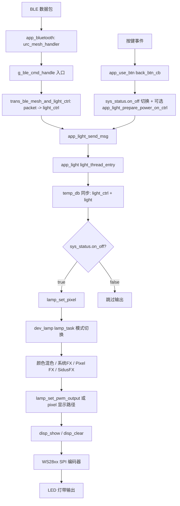

# ESP-IDF 智能灯光控制 — 端到端控制链路分析

本文档分析了当前项目从输入（BLE/按键/本地状态）到硬件输出（WS28xx）的完整控制链，包括消息路由、效果分发、temp DB/NVS 持久化以及发现的设计缺陷。

---

## 1) 架构概览（关键模块）

### 应用层 (`main/`)
- `main/main.c`
  - 启动顺序：`database_init()` → `ws28xx_init()` → `app_light_init()` → `app_use_init()` → power/RS485/Wi-Fi 任务。
- `main/app/app_bluetooth.c`
  - BLE 命令接收与分发（`urc_mesh_handler` + `g_ble_cmd_handle`）。
  - 通过 `trans_ble_mesh_and_light_ctrl.c` 将协议解析为 `light_ctrl`。
- `main/app/app_use_btn.c`
  - 本地按键扫描/回调路径，切换电源并发送恢复的控制。
- `main/app/app_light.c`
  - 核心灯光消息队列与灯光控制线程。
  - `app_light_send_msg` → `light_thread_entry` → temp DB 同步 + 转发到 lamp 驱动。
- `main/app/app_local_db.c`
  - 初始化 temp DB + NVS 恢复。
  - 后台 DB 线程持久化已更改的 temp DB 键值。

### 设备/驱动层
- `components/dev_lamp/dev_lamp.c`
  - 主灯光控制分发器（`lamp_set_pixel` + `lamp_task` 模式切换）。
  - 将静态/效果输出桥接到 PWM/WS 输出路径。
- `components/dev_ws28xx/dev_ws28xx.c`
  - 显示缓冲区 + `disp_show`/`disp_clear`。
- `components/dev_ws28xx/led_spi_strip_encoder.c`
  - WS2812 SPI 编码与传输（`led_spi_strip_encoder_send[_count]`）。

### 效果/转换层
- `modules/protocol/trans_ble_mesh_and_light_ctrl.c`
  - BLE ↔ `light_ctrl` 转换（CCT/HSI/系统 FX/Sidus）。
- `modules/fx_structure_tools/trans_light_ctrl_to_fx_legacy.c`
  - `light_ctrl` → 系统 FX / Pixel FX / Sidus / RS485 FX 结构体。
- `modules/light_effect/*`
  - 系统 FX 引擎（`Effect_Data_Init`、`Effect_Per1msCallback`、`Light_Effect_Enable`）。
- `modules/light_effect_pixel/*`
  - Pixel FX 运行时（`pixel_effect_init/task/enable` + 分区效果）。
- `modules/SidusProFX/*`
  - Sidus FX 任务 + 队列 + 1ms 回调（`SidusProFX_Task`、`SidusProFX_1Ms_Callback`）。

### 共享运行时 DB
- `utilities/temp_db/temp_db.c`
  - 命名的共享内存块（`temp_db_create/find/read/write`）。
- `main/app/app_local_db.c`
  - 写钩子标记条目为脏；`db_thread_entry` 刷新到 NVS。

---

## 2) 端到端控制链

### 2.1 高层流程（BLE/按键 → LED）

---

## 3) 输入路径

### 3.1 BLE 输入 (`main/app/app_bluetooth.c`)
#### 入口
- `urc_mesh_handler(void *buffer, rt_size_t size)`
  - 验证数据包（`mesh_protocol_packet_check`）。
  - 遍历 `g_ble_cmd_handle[]` 并调用映射的处理函数。

#### 主要 BLE 处理器
- 静态/基本灯光：`app_ble_proto_common_light`
  - 调用 `common_light_ble_to_light_ctrl(packet, &ctrl)`。
  - 通过 `app_light_send_msg(&ctrl)` 发送到灯光流水线。
- 系统 FX：`app_ble_proto_fx`
  - 调用 `fx_ble_to_light_ctrl(packet, &ctrl)`。
  - `app_light_send_msg(&ctrl)`。
- Sidus PFX：`app_ble_proto_sidus_pfx`
  - 调用 `sidus_pfx_ble_to_light_ctrl`。
  - `app_light_send_msg`。
- 睡眠/电源：`app_ble_proto_sleep_mode`
  - 更新 temp DB 中的 `sys_status.on_off`。
  - ON 时：恢复控制（`app_light_prepare_power_on_ctrl`）+ `drv_lamp_control(POWERON)` + 发送消息。
  - OFF 时：`drv_lamp_control(POWEROFF)`。
- 亮度：`app_ble_proto_light_bright`
  - `drv_lamp_control(SET_BRIGHTNESS)` + 更新/读取 `light_ctrl` + 发送消息。

#### 使用的转换层
- `common_light_ble_to_light_ctrl`
- `fx_ble_to_light_ctrl`
- `sidus_pfx_ble_to_light_ctrl`
- `sidus_cfx_ble_to_light_ctrl` / `sidus_mfx_ble_to_light_ctrl`（在转换器中实现，但见缺陷部分关于处理函数使用情况）。

---

### 3.2 按键输入 (`main/app/app_use_btn.c`)
- `btn_thread_entry`：每 20ms 调用一次 `flex_button_scan()`。
- `back_btn_cb` 在 `FLEX_BTN_PRESS_CLICK` 时：
  - 读取 `sys_status.on_off`，切换并写回。
  - 如果 ON：
    - `app_light_prepare_power_on_ctrl(&light)`
    - `drv_lamp_control(RTGRAPHIC_CTRL_POWERON, NULL)`
    - `app_light_send_msg(&light)`
  - 如果 OFF：
    - `drv_lamp_control(RTGRAPHIC_CTRL_POWEROFF, NULL)`

这是物理本地电源控制的入口路径。

---

### 3.3 本地控制路径（设备本地状态/控制）
在当前代码库中，"本地控制"主要包括：
1. **电源恢复路径**
   - `app_light_prepare_power_on_ctrl` 从 temp DB 读取缓存的 `light_ctrl`，规范化分区模式，并同步回去。
2. **本地驱动控制 API**
   - `drv_lamp_control(...)` 直接处理电源/亮度/模式命令。
3. **启动恢复路径**
   - `database_init` 从 NVS 恢复 `light` 到 temp DB，然后复制到 `light_ctrl`。
   - `app_light_init` 读取并初始化运行时。

---

## 4) 消息处理路径（必需链路）

### 4.1 `app_light_send_msg` → 队列
- `app_light_send_msg(struct light_ctrl *ctrl)` 将控制推送到 `g_light_queue`（`xQueueSend`，10ms 超时）。
- 队列在 `app_light_init` 中创建，长度为 6。

### 4.2 `light_thread_entry`
- 轮询队列（`xQueueReceive(..., 0)` + `vTaskDelay(5)` 循环）。
- 收到消息时：
  1. 从 `temp_db` 读取电源状态（`sys_status.on_off`）。
  2. 强制设置 `ctrl.fade_time = 350`。
  3. 加锁。
  4. 调用 `app_light_prepare_ctrl_for_apply_locked(&ctrl)`：
     - 处理分区模式缓存/恢复逻辑。
  5. 同步 temp DB：
     - `temp_db_write("light_ctrl", ...)`
     - `temp_db_write("light", ...)`
  6. 解锁。
  7. 如果电源 ON：`lamp_set_pixel((void*)&ctrl)`。

这是核心的**应用层控制仲裁点**。

---

## 5) Lamp 设备分发（必需链路）

### 5.1 `lamp_set_pixel`
- 将传入的 `light_ctrl` 复制到本地 `ctrl`。
- 特殊处理：
  - `LIGHT_FX_I_AM_HERE` 和 `LIGHT_FX_SOS` 更新状态标志并提前返回。
- 否则复制到 `s_lamp_device.ctrl` 并释放 `lamp->sem`。

### 5.2 `lamp_task` 主开关
`lamp_task` 等待信号量，然后按 `lamp->ctrl.mode` 分发：
- 静态模式：
  - `LIGHT_MODE_CCT/HSI/GEL/SOURCE/MIXING/XY` → 颜色计算到 `lux_fade.set_value`。
  - `LIGHT_MODE_RGB` 和 `LIGHT_MODE_PWM` → 直接 PWM 输出路径。
- Pixel 模式：
  - `light_ctrl_to_pixel_fx` → `pixel_effect_init` → `pixel_effect_enable`。
- 系统 FX 范围：
  - `light_ctrl_to_fx` → `Effect_Data_Init` → `Light_Effect_Enable(true/false)`。
- Sidus：
  - 构建 Sidus 参数（`light_ctrl_to_sidus_pfx` / `light_ctrl_to_sidus_cfx_preview`）→ `SidusProFX_Arg_Init`。
  - `SidusProFX_Enable(mode == LIGHT_FX_SIDUS_FX)`。

---

## 6) 效果模块（CCT/HSI/Pixel/SidusFX/系统）

### 6.1 颜色混色/静态转换
- 通过 `lamp_task` 和效果接口中的颜色计算端口调用实现：
  - `color_calc_cct`、`color_calc_hsi`、`color_calc_mixing` 等。
- 静态和系统/Sidus 结果最终成为 PWM 或 WS 背景色。

### 6.2 系统 FX (`modules/light_effect`)
- `Effect_Data_Init(const Light_Effect* effect, uint8_t force)` 更新效果状态。
- `Effect_Per1msCallback()` 在启用时调用 `Effect_Deal(...)`。
- `Light_Effect_Enable(bool)` 切换运行时。
- 输出桥接：`Effect_Set_Lux`（在 `light_effect_interface.c` 中）→ `lamp_set_lux_output`。

### 6.3 Pixel FX (`modules/light_effect_pixel`)
- 初始化：`pixel_effect_init`。
- 运行时：`pixel_effect_task`（由 `dev_lamp` 中的 `pixel_fx_task` 调用）。
- 通过 `pixel_effect_enable/disable` 启用/禁用。
- 包括分区模式（`PIXEL_FX_PARTITION`），具有左右区域渲染和逐点 CCT/HSI 转换。
- 渲染桥接：
  - `pixel_effect_fill` → `disp_flush`
  - `pixel_effect_set_pwm` → `disp_show`

### 6.4 SidusFX (`modules/SidusProFX`)
- 生产者任务：`SidusProFX_Task`（生成 PWM 帧到队列）。
- 消费者回调：`SidusProFX_1Ms_Callback`（弹出队列并应用 `SidusPro_Set_Pwm`）。
- `SidusPro_Set_Pwm` 调用 `lamp_set_pwm_output`。

---

## 7) 输出链路（必需：`disp_show/disp_clear` → WS28xx）

### 7.1 输出缓冲
两条主要输出路径：
1. **PWM/背景路径**
   - `lamp_set_pwm_output` 更新 `s_lamp_device.lamp_set_pwm` 并释放 `pwm_sem`。
   - `lamp_pwm_task` 接收信号量，对于非 Pixel 模式：
     - `disp_background_color_pwm_set(r,g,b)`
     - `disp_show()`
2. **Pixel 路径**
   - Pixel 效果通过 `disp_flush(...)` 写入完整帧。
   - 然后 `pixel_effect_set_pwm` 调用 `disp_show()`。

电源关闭：
- `drv_lamp_control(POWEROFF)` → `disp_clear()` + `disp_show()`。

### 7.2 WS28xx 驱动链
- `disp_show` 遍历 LED 缓冲区并调用：
  - 每个 LED 调用 `led_spi_strip_encoder(i, g,r,b)`
  - `led_spi_strip_encoder_send()`
- SPI 传输：
  - `spi_device_queue_trans` + `spi_device_get_trans_result`。
- 物理时序编码：
  - WS2812 位模式（`1110` 表示 1，`1000` 表示 0）在 `led_spi_strip_encoder.c` 中。

---

## 8) NVS 持久化流程（必需）

### 8.1 启动恢复
- `database_init()`：
  - `nvs_flash_init`
  - 对每个 `memery_data[]` 项（特别是 `"light"`、`"sys_cfg"`）：
    - `db_nvs_recovery(name, data, size)`
    - `temp_db_create(name, size, data)`
    - `temp_db_set_write_hook(...db_write_hook...)`
  - 创建仅临时 DB 键（`"light_ctrl"`、`"sys_status"`）。
  - 将持久的 `"light"` 复制到运行时 `"light_ctrl"`。

### 8.2 运行时写路径
- 应用层通过 `temp_db_write` 写入 `"light_ctrl"` 和 `"light"`。
- `temp_db_write` 触发写钩子，设置 `change=true`，发送 `db_sem`。

### 8.3 后台刷新线程
- `db_thread_entry` 在信号量上唤醒，扫描已更改的项：
  - `db_nvs_save(name, data, size)` → `nvs_set_blob` + `nvs_commit`。
- 持久化集合包括 `"light"` 和 `"sys_cfg"`（来自 `memery_data`）以及 `"factory_power"`（来自 `persist_data`）。

这实现了 **temp_db 作为运行时数据源 + 延迟 NVS 持久化**。

---

## 9) 按模式类型的控制链（实际视角）

1. **来自 BLE 的 CCT/HSI/GEL/XY 等**
   - BLE 解码 → `light_ctrl` → 应用队列 → DB 同步 → `lamp_set_pixel` → `lamp_task` 静态分支 → 颜色计算 → PWM 信号量 → `disp_show` → WS2812。
2. **系统 FX**
   - BLE FX 解码 → `light_ctrl` → `light_ctrl_to_fx` → `Effect_Data_Init` + `Light_Effect_Enable` → 定时器回调计算 lux → `lamp_set_lux_output` → `disp_show`。
3. **Pixel FX**
   - BLE/本地模式设置 pixel 类型 → `light_ctrl_to_pixel_fx` → `pixel_effect_init`/enable → pixel 任务循环 → `disp_flush` + `disp_show`。
4. **SidusFX**
   - BLE Sidus 数据包 → `sidus_*_ble_to_light_ctrl` → `light_ctrl_to_sidus_*` → `SidusProFX_Arg_Init` + enable → `SidusProFX_Task` 生产者 + `SidusProFX_1Ms_Callback` 消费者 → `lamp_set_pwm_output` → `disp_show`。

---

## 10) 潜在问题/缺陷分析

1. **蓝牙初始化路径似乎未接入启动序列**
  - `app_bluetooth_init()` 存在，但当前入口 `main/main.c` 中的 `app_main()` 未调用它。
   - 如果没有其他模块调用 BLE 初始化，BLE 控制路径将永远不会激活。

2. **BLE 分发中可能的空函数指针崩溃**
   - `g_ble_cmd_handle` 包含 `{BT_CommandType_Board_State, NULL}`。
   - `urc_mesh_handler` 调用 `g_ble_cmd_handle[i].handle(...)` 时未进行空指针检查。

3. **CFX/MFX 处理器已映射但在实际应用层中无效**
   - `app_ble_proto_sidus_cfx` 和 `app_ble_proto_sidus_mfx` 的转换/发送逻辑被注释掉。
   - 然而命令映射包含 `BT_CommandType_CFX_Preview` 和 `BT_CommandType_MFX`。
   - 结果：命令在映射层面被接受但未应用到灯光路径。

4. **反向 Sidus BLE 转换函数被注释**
   - 在转换器中，`sidus_*_light_ctrl_to_ble` 块被注释；影响完整的双向同步/确认可靠性。

5. **`common_light_ctrl_to_light_ble` XY 打包似乎错误**
   - 使用数据包字段计算数据包字段（`packet->body.xy_coordinate_body... = packet->body...`）而不是读取 `ctrl->xy`。
   - 可能是 XY 模式的过时/错误回读路径。

6. **`light_thread_entry` 覆盖传入的渐变时间**
   - 无条件设置 `ctrl.fade_time = 350`，可能丢弃调用者意图。

7. **`dev_lamp` 中的队列/信号量设计遗留**
   - `lamp_queue`/`queue_sem` 已声明但在活跃分发路径中未使用。
   - 实际触发器是来自 `lamp_set_pixel` 的信号量 `lamp->sem`。

8. **DB 线程信号量处理不寻常**
   - `xSemaphoreTake(db_sem, portMAX_DELAY); xSemaphoreTake(db_sem, 0);`
   - 第二次获取消耗额外令牌；作为合并可以隐藏写入突发时序。

9. **FX 转换器中不安全/奇怪的代码遗留**
   - `areffect_argg->rgbww.g` 拼写错误在 `trans_light_ctrl_to_fx_legacy.c` 中表明遗留/非活动分支的质量风险。

10. **Light 线程中的忙轮询接收**
    - `xQueueReceive(..., 0)` + 固定 `vTaskDelay(5)` 是轮询。
    - 功能上可用，但在负载下非阻塞接收可能增加延迟/抖动。

---

## 11) 总结

该项目实现了一个分层且大部分连贯的控制流水线：

- **输入**（BLE/按键/本地恢复）创建/更新 `light_ctrl`。
- **应用层仲裁**（`app_light`）序列化命令，同步运行时 DB（`light_ctrl` + `light`），并根据电源状态条件分发。
- **Lamp 分发器**（`dev_lamp`）分转到静态颜色混色、系统 FX、Pixel FX 和 SidusFX 子系统。
- **输出** 汇聚到 `disp_show/disp_clear`，最终到 WS2812 SPI 传输。
- **持久化** 通过 temp DB 写钩子和 `db_thread` 中的延迟 NVS 刷新解耦。

最大的操作风险在于 BLE 路径的完整性和安全性（初始化连接、空指针调用、部分禁用的 Sidus 命令处理器），而不是下游灯光/效果/输出链路本身。