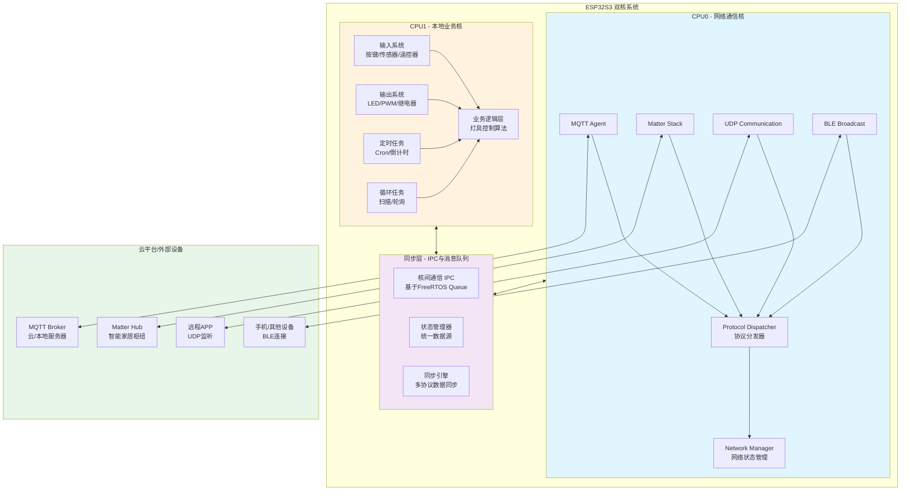

# ESP32S3 双核智能灯具系统 - 项目架构设计

> 状态说明：本文是概念架构说明，用于表达双核分工、状态同步和多协议协同思路，不是当前仓库的精确文件树与运行时实现清单。
>
> 当前真实目录结构与活跃入口请优先参考：
> - `docs/architecture/PROJECT_STRUCTURE.md`
> - `docs/architecture/ARCHITECTURE.md`
> - `main/main.cpp`

## 一、系统概述

基于ESP32S3的双核智能灯具系统，采用核心分离架构，CPU0负责网络通信，CPU1处理本地业务逻辑，实现设备在线离线无缝切换。

---

## 二、系统架构

### 2.1 核心设计原则

- **CPU0（网络核）**：处理所有网络通信协议（MQTT、Matter、UDP、BLE）
- **CPU1（业务核）**：处理本地输入/输出、定时任务、循环任务
- **IPC通信**：基于队列或共享内存的核间消息通信
- **状态管理**：统一的状态同步机制，确保多协议数据一致性

### 2.2 工作阶段划分

#### 阶段1：初始化阶段（无IP）
```
设备刚启动 → BLE广播开启 → 等待WiFi连接
- 仅支持BLE通信
- CPU1执行本地业务（输入/输出/定时任务）
- 无网络协议参与
```

#### 阶段2：联网后（有IP）
```
成功获取IP → 激活所有网络协议 → 完整同步
- MQTT、UDP、Matter、BLE全部启动
- 多协议数据实时同步
- 本地变化同步到云/其他设备
```

---

## 三、系统架构图



---

## 四、核心模块设计

### 4.1 状态管理模块

```
统一数据模型
├── 设备状态
│   ├── 电源状态（开/关）
│   ├── 亮度（0-100/0-255）
│   ├── 色温（2700K-6500K）
│   ├── 工作模式（正常/呼吸/闪烁等）
│   └── 故障状态
├── 网络状态
│   ├── WiFi信号强度
│   ├── IP地址
│   ├── 协议连接状态
│   └── 时间戳
└── 仪表盘数据
    ├── 工作时长
    ├── 能耗统计
    └── 故障日志
```

### 4.2 数据同步流程

```
本地变化 → CPU1业务逻辑 → IPC消息 → StateManager
     ↓
  同步引擎 → MQTT消息 ↓
          → Matter事件 → 云平台/协议端点
          → UDP广播  ↓
          → 返回本地显示
```

### 4.3 网络初始化流程

```
系统启动
  ↓
CPU0: WiFi扫描 → 连接
  ↓
无网络？ → 进入BLE-Only模式 ─→ [等待WiFi恢复]
  ↓
有网络且获得IP ↓
  ↓
  ├─→ MQTT连接 → 订阅/发布主题
  ├─→ Matter启动 → 加入Fabric
  ├─→ UDP启动 → 监听广播端口
  └─→ BLE继续广播（可选：设置只读模式）
  ↓
所有协议启动完成，进入完整同步模式
```

---

## 五、通信协议选型

| 协议 | 用途 | 优先级 | 特点 | 网络依赖 |
|------|------|--------|------|---------|
| **MQTT** | 云端实时控制与数据 | P0 | 低功耗、可靠 | 必需IP |
| **Matter** | 智能家居生态 | P0 | 标准化、跨平台 | 必需IP |
| **UDP** | 局域网快速控制 | P1 | 低延迟、实时性好 | 必需IP |
| **BLE** | 本地蓝牙控制 | P1 | 低功耗、本地优先 | 无依赖 |

---

## 六、参考性文件结构（非当前仓库精确路径）

下列树形结构用于解释“网络层 / 同步层 / 本地业务层”的概念分层，不能直接当作当前仓库路径使用。

当前仓库已经演进为：

- `main/main.cpp` + `main/DeviceCallbacks.cpp` 作为 Matter 与应用入口
- `components/framework/` 承担 state_manager / ipc_manager / protocol_dispatcher / common
- `components/network/` 承担 mqtt_agent / cmd_wifi / sync_time / at / message_proto
- `components/app/local_output/` 与 `main/app/`、`main/light/` 共同承接 CPU1 本地输出与灯控编排

如果需要按当前代码定位模块，请不要使用下面这份示意树，改查 `PROJECT_STRUCTURE.md`。

```
SmartLight/
├── README.md                          # 项目说明
├── CMakeLists.txt                     # 构建配置
│
├── main/
│   ├── main.c                         # 系统入口
│   ├── common/
│   │   ├── config.h                   # 全局配置
│   │   ├── typedef.h                  # 类型定义
│   │   └── log.h                      # 日志系统
│   │
│   ├── ipc/                           # IPC & 核间通信
│   │   ├── ipc_message.h              # 消息定义
│   │   ├── ipc_queue.c                # 消息队列
│   │   └── state_manager.c            # 状态管理
│   │
│   ├── network/                       # CPU0 - 网络层
│   │   ├── network_manager.c          # 网络管理
│   │   ├── wifi/
│   │   │   └── wifi_task.c            # WiFi连接
│   │   ├── mqtt/
│   │   │   ├── mqtt_task.c            # MQTT任务
│   │   │   └── mqtt_handler.c         # MQTT消息处理
│   │   ├── matter/
│   │   │   ├── matter_task.c          # Matter集成
│   │   │   └── matter_handler.c       # Matter事件处理
│   │   ├── udp/
│   │   │   ├── udp_task.c             # UDP任务
│   │   │   └── udp_handler.c          # UDP处理
│   │   └── ble/
│   │       ├── ble_task.c             # BLE任务
│   │       └── ble_handler.c          # BLE消息处理
│   │
│   └── local/                         # CPU1 - 本地业务层
│       ├── local_manager.c            # 本地任务管理
│       ├── input/
│       │   ├── input_system.c         # 输入系统
│       │   ├── button_handler.c       # 按键处理
│       │   └── sensor_handler.c       # 传感器处理
│       ├── output/
│       │   ├── output_system.c        # 输出系统
│       │   ├── led_control.c          # LED控制
│       │   └── pwm_control.c          # PWM控制
│       ├── scheduler/
│       │   ├── timer_task.c           # 定时任务
│       │   └── loop_task.c            # 循环任务
│       └── logic/
│           ├── device_logic.c         # 设备逻辑
│           └── animation.c            # 灯光动画
│
└── components/                        # 第三方组件
    ├── esp-mqtt/
    ├── esp-matter/
    └── ...
```

---

## 七、核心交互流程

### 7.1 本地按键控制流程

```
用户按键 (CPU1)
  ↓
Button Handler 识别按键 → 业务逻辑处理
  ↓
设置新状态（亮度、颜色等）→ 更新OutputSystem
  ↓
状态变化 → StateManager 更新共享状态
  ↓
IPC消息 → CPU0
  ↓
Protocol Dispatcher 分发到所有协议
  ↓
├─→ MQTT 发布状态变化
├─→ Matter 发送事件
├─→ UDP 广播状态
└─→ BLE 发送本地可见状态
  ↓
云平台/其他设备接收更新
```

### 7.2 MQTT云端下发流程

```
云平台发送 MQTT 消息
  ↓
CPU0 MQTT Agent 接收
  ↓
StateManager 更新状态
  ↓
IPC消息 → CPU1
  ↓
Local Manager 处理状态变化
  ↓
OutputSystem 执行控制（LED/PWM等）
  ↓
用户看到灯光变化
  ↓
状态反馈 → StateManager
  ↓
其他协议同步（Matter/UDP/BLE）
  ↓
云平台接收反馈
```

### 7.3 网络中断恢复流程

```
WiFi 断开
  ↓
NetManager 检测到无网络
  ↓
所有网络协议标记为离线
  ↓
BLE 模式保持活跃
  ↓
CPU1 继续本地业务运行
  ↓
用户可通过 BLE 本地控制
  ↓
WiFi 重新连接 → 获得 IP
  ↓
所有协议重新初始化
  ↓
数据同步（本地状态上传到云）
  ↓
恢复完整功能
```

---

## 八、关键设计考虑

### 8.1 数据一致性

- **单源信任**：StateManager 为唯一的状态源
- **版本号机制**：每次状态变化增加版本号，防止重复同步
- **时间戳**：记录状态变化时间，便于排序和判重
- **环路检测**：防止A→B→A的数据循环

### 8.2 网络优化

- **离线-在线合并**：设备离线期间的本地操作，在恢复网络后一次性同步
- **协议优先级**：优先使用低延迟协议（UDP > MQTT）
- **心跳机制**：定期发送心跳包，检测网络连通性
- **自适应重连**：指数退避算法，防止连接风暴

### 8.3 电源管理

- **CPU1轻载优化**：CPU1长时间空闲时进入低功耗模式
- **BLE广播间隔动态调整**：根据网络状态调整（有网络时降低间隔）
- **定时唤醒**：定时任务精确唤醒核心

### 8.4 容错与恢复

- **看门狗机制**：两核均设置独立看门狗
- **日志与内存转储**：崩溃时保存日志便于调试
- **自动重启恢复**：异常自动恢复到安全状态

---

## 九、开发建议

### 9.1 开发阶段

1. **第一阶段**：CPU1 本地业务 + IPC通信基础
2. **第二阶段**：CPU0 WiFi + BLE
3. **第三阶段**：MQTT 协议与同步
4. **第四阶段**：Matter 协议集成
5. **第五阶段**：UDP 协议打磨与稳定性增强
6. **第六阶段**：性能优化与功耗测试

### 9.2 测试用例

- ✅ 本地输入 → 所有协议同步
- ✅ 云端下发 → 本地执行反馈
- ✅ 多协议同时下发 → 无冲突
- ✅ 网络中断恢复 → 数据不丢失
- ✅ BLE-Only 模式正常工作
- ✅ 极限网络条件下稳定性

### 9.3 调试工具推荐

- **MQTT.fx** / **HiveMQ WebSocket Client**：MQTT 调试
- **Wireshark**：UDP 网络分析
- **Bleah** / **BLE Scanner**：BLE 调试
- **ESP-IDF Monitor**：串口日志监控

---

## 十、总结

这个架构通过核心分离、IPC通信、状态管理、多协议同步等关键设计，实现了一个高效、可靠的智能灯具系统。核心优势：

- ✅ **解耦清晰**：网络与业务逻辑完全分离
- ✅ **可靠同步**：多协议数据始终保持一致
- ✅ **优雅降级**：无网络时 BLE 保持可用
- ✅ **扩展性强**：易于添加新协议或功能
- ✅ **开发效率高**：两个团队可并行开发不同核心
