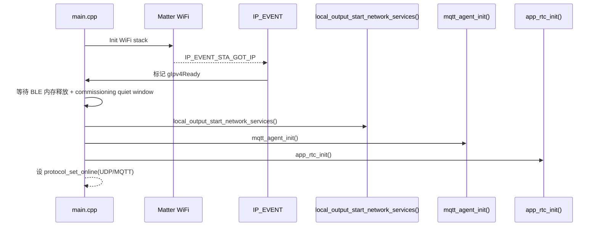
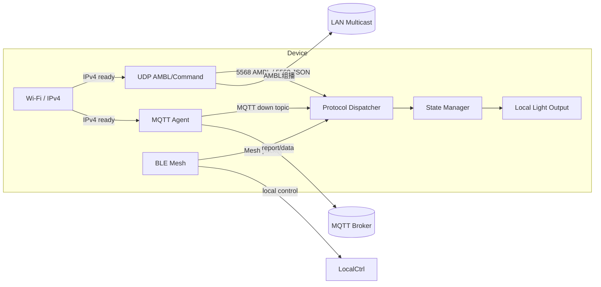

# 网络架构总览

本文档整理当前 `Aputure_IP_Project` 工程中的网络架构，覆盖：Wi-Fi/IP 启动、UDP/AMBL 本地网络服务、MQTT 云通道、Matter 连接、BLE 兜底、协议分发及状态同步。

## 1. 总体架构

设备网络栈分为四个主要层级：

- Wi-Fi/IP 层：由 Matter `ConnectivityMgr` 管理 Wi-Fi STA 连接；IPv4 就绪是高层网络服务启动的前提。
- 本地 UDP 服务层：`local_output_start_network_services()` 启动 CPU1 的 UDP 组播/单播服务，主要用于 AMBL 灯效流和 UDP 倒计时命令。
- MQTT 云服务层：`mqtt_agent_init()` 启动 MQTT 客户端，连接云端 Broker，负责云端控制与状态回传。
- 统一协议分发层：`protocol_dispatcher` 负责多协议状态同源管理，避免 MQTT/UDP/BLE 状态冲突。

### 1.1 运行时职责

- `main/main.cpp` 负责网络服务的时序控制与‘静默期’策略。
- `components/app/local_output` + `main/app/local_manager.c` 管理本地 UDP 相关服务。
- `components/network/mqtt_agent` 管理 MQTT 客户端与主题解析。
- `components/framework/common/network_event.*` 定义全局网络事件基础。
- `main/app/app_bluetooth.c` 负责 Bluetooth Mesh 数据包桥接与不同来源状态应用。

## 2. 启动流程

## 3. 关键网络通道

### 3.1 UDP AMBL 实时灯效流

- 目标地址：`239.255.23.42:5568`
- 协议：UDP 组播
- 入口：`main/app/local_manager.c` -> `ambient_output_start()` / `ambient_receiver_start()` / `ambient_command_start()`
- 作用：接收实时 RGBA 灯效帧并直接驱动本地灯光输出
- 特性：最新帧覆盖、低延迟、组播丢包可接受

### 3.2 UDP 命令口

- 目标端口：`5569`
- 协议：UDP 单播
- 用途：倒计时命令、查询、列表、统计等 JSON 操作
- 入口：`components/network/cmd_wifi/ambient_command.c` 内解析和状态分发

### 3.3 MQTT 云通道

- 默认 Broker：`mqtts://broker.emqx.io:8883`
- 主题结构：
  - `iot/device/{mac}/down`
  - `iot/device/group/down`
  - `iot/device/all/down`
  - `iot/device/{mac}/timer`
  - `iot/device/{mac}/timer_reply`
  - `report/data`
- 入口：`components/network/mqtt_agent/src/mqtt_agent.c`
- 玩法：下行控制、定时任务、查询、状态上报

### 3.4 BLE 本地/commissioning

- 作用：配网、近距离控制、离线兜底
- 入口：`main/app/app_bluetooth.c` / `app_bluetooth_handle_mesh_packet_with_source()`
- 与 MQTT/UDP 协同方式：所有控制包统一进入状态管理，由 protocol_dispatcher 管理同源策略

## 4. 网络服务状态与协议在线管理

- `protocol_set_online(PROTOCOL_ID_UDP, true/false)`：当 IP 可用/失效时由 `main/main.cpp` 切换 UDP 在线状态
- `protocol_set_online(PROTOCOL_ID_MQTT, true/false)`：当 MQTT 连接成功或断开时更新在线状态
- `protocol_set_online(PROTOCOL_ID_MATTER, true)`：Matter 栈初始化完成后启用

## 5. 核心消息流

## 6. 端口与协议映射

| 通道 | 目标地址 / 端口 | 描述 |
|---|---|---|
| UDP 实时灯效 | `239.255.23.42:5568` | AMBL 组播实时 RGBA 灯效数据 |
| UDP 命令口 | `device_ip:5569` | JSON 倒计时/控制/查询命令 |
| MQTT 云连接 | `mqtts://...:8883` | 云端命令、定时任务、状态上报 |
| BLE | Mesh Vendor Packet | 本地近场配网与控制 |

## 7. 核心启动时序说明

1. `main/main.cpp` 初始化全局状态、Matter、协议分发。
2. Matter 初始化 Wi-Fi STA。获取 IP 后触发 `gIpv4Ready`。
3. 等待 BLE 内存释放、commissioning quiet window 结束。
4. 启动 `local_output_start_network_services()`：开启 UDP AMBL/命令链路。
5. 启动 `app_rtc_init()`：开始时间/时区同步任务。
6. 启动 `mqtt_agent_init()`：连接 Broker 并订阅控制主题。

## 8. 设计要点总结

- **Wi-Fi/IP 就绪是所有高层服务启动的守门人**。
- **UDP 与 MQTT 双通道并行**，UDP 侧重低延迟灯效，MQTT 侧重云控制与状态同步。
- **统一状态分发层降低了多协议冲突风险**。
- **BLE 作为本地兜底通道**，在 IP 丢失或无线干扰时继续提供控制入口。
- **当前实现优先“最新帧覆盖”而不是“完整重传”**，适用于实时灯效场景。

---

> 本文档基于当前工程实际代码实现整理，适合作为网络架构说明与交付参考。如果你希望，我也可以继续把这份内容拆成“网络协议手册”和“调试流程图”两个独立文档。